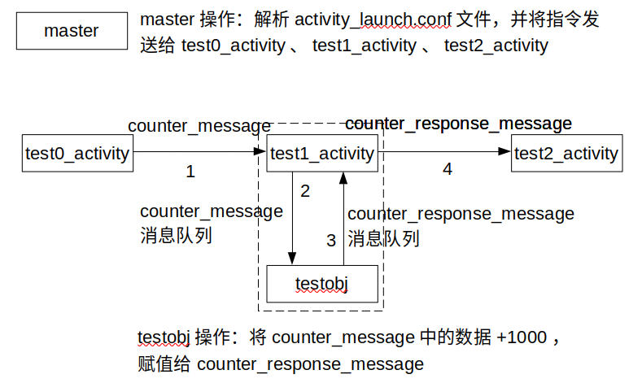

# DDSProject-example

## 镜像地址
服务器（192.168.0.3）中/home/znzx/docker/目录下

## 目录结构
* include： 头文件
* lib : 动态库
* submodules : 第三方库
* bin : master可执行文件所在目录
* activities : 各类activity所在目录
    - conf : 所有配置文件所在的目录
        - activity_launch.conf : master解析文件，对应结构在下文中说明
        - master_node.conf  : master配置文件，对应结构在下文中说明
        - test0_activity.info : test0_acticity配置文件，对应结构在下文中说明
        - test1_activity.info : test1_activity配置文件，对应结构在下文中说明
        - test2_activity.info : test2_activity配置文件，对应结构在下文中说明
    - idl 
        - counter_message.idl : test0_activity和test1_activity之间通信的idl文件
        - counter_response_message.idl : test1_activity和test2_activity之间通信的idl文件
        - genetate.sh : 使用shell脚本将idl文件生成对应的cpp文件
    - test0_activity
        - conf : test0_activity的私有配置文件，对应结构在父目录的proto文件夹下
        - proto:
            - test0_activity.proto : test0_activity的私有配置信息
            - generate.sh : 使用shell脚本将proto文件生成对应的cpp文件
        - test0_activity.cpp
    - test1_activity : 文件结构说明同test0_activity
    - test2_activity : 文件结构说明同test0_activity
* output : 编译文件生成的目录
    - bin : 生成的可执行文件所在的路径
    - gen : submodules/ddsproject-config对应的idl和proto生成路径
    - lib : 生成的动态库所在的路径，存放activity对应的动态库的路径

## 构建
### 构建方法一
通过shell脚本生成idl和proto对应的c++文件
```
git clone git@192.168.0.3:software/ddsproject-example.git
cd ddsproject-example
git submodule update --init
sh generate.sh
mkdir build && cd build
cmake ..
make
```

### 构建方法二
通过cmakelist生成idl和proto对应的c++文件
```
git clone git@192.168.0.3:software/ddsproject-example.git
cd ddsproject-example
git submodule update --init
source env.sh
mkdir build && cd build
cmake -DGENERATE_IDL=ON -DGENERATE_PROTO=ON ..
make
```

## 运行
test0_activity、test1_activity和test2_activity之间的数据传输如下所示


> 说明
> 1. counter_message是tes0_activity和test1_activity之间传输的数据格式，idl文件
> 2. counter_response_message是test1_activity和test2_activity之间传输的数据格式，idl文件
> 3. test1_activity创建testobj对象
> 4. 在test1_activity中有两个消息队列
>   - 一个消息队列存储counter_message数据
>       - push : 由test0_activity发送的counter_message数据
>       - pop : 由testobj获取队列数据并处里
>   - 一个消息队列存储counter_response_message数据
>       - push: testobj处理counter_message之后的结果
>       - pop : 一个线程循环获取数据并发送给test2_activity
> 5. test1_activity创建两个线程：
>   - 循环从存储counter_message数据的消息队列中获取数据，并交由testobj进行处理
>   - 循环从存储counter_response_message数据的消息队列中获取数据，并发送给test2_activity


### 运行方法一
#### 实现方法
实现main函数，为每个activity生成对应的可执行文件，可通过**int main(int argv, char* argc)**获取命令行参数，比如：配置文件路径，需自行解析命令行参数

#### 注意
1. activity对应main函数实现（详细见activity cpp文件）
2. activity配置文件修改，对应配置文件为activities/conf/xxx.info
3. activity对应的cmakelist文件修改（详细见具体cmakelist注释）

> 配置文件修改说明
> 1. 如果使用fastdds udp进行通信，注意设置master、test0_activity、test1_activity、test2_activity的node_conf配置中的white_list为本环境下的ip地址
> 2. 在test0_activity、test1_activity、test2_activity对应的cpp文件的main函数中正确设置配置文件路径

#### 运行
打开四个窗口，在每个窗口中执行**export LD_LIBRARY_PATH=$LD_LIBRARY_PATH:/workspace/ddsproject-example/lib/**，具体路径按照当前工程的路径声明
- 窗口1执行test0_acticity
```
./test0_acticity
```
- 窗口2执行test1_acticity
```
./test1_acticity
```
- 窗口3执行test2_acticity
```
./test2_acticity
```
- 窗口4执行master，具体配置文件路径按照实际路径填写
```
./master -c /workspace/ddsproject-example/activities/conf/master_node.conf -l /workspace/ddsproject-example/activities/conf/activity_launch.conf
```

#### 关闭
1. 只关闭某个activity，将activity_launch.conf文件中对应的activity字段中的shutdown设置为true
2. 关闭所有activity
    - 在master进程窗口执行ctrl + c

### 运行方法二
#### 实现方法
在activity类声明后，通过宏函数**REGISTER_ACTIVITY(CLASS_NAME)**注册类

#### 注意
1. 在类声明后通过宏函数注册类
2. activity配置文件修改，对应配置文件为activities/conf/xxx.dag，在该配置文件中声明了**动态库路径（必须）**，配置文件详细说明见下文
3. activity对应的cmakelist文件修改（详细见具体cmakelist注释）

> 配置文件修改说明
> 1. 如果使用fastdds udp进行通信，注意设置master、test0_activity、test1_activity、test2_activity的node_conf配置中的white_list为本环境下的ip地址
> 2. 在xxx.dag文件中正确设置配置文件路径
> 3. 在xxx.dag文件中设置activity的动态库路径（**必须**）

#### 运行
打开四个窗口，在每个窗口中执行**export LD_LIBRARY_PATH=$LD_LIBRARY_PATH:/workspace/ddsproject-example/lib/**，具体路径按照当前工程的路径声明
- 窗口1执行test0_acticity
```
./activity_exec -c /workspace/ddsproject-example/activities/conf/test0_activity.dag
```
- 窗口2执行test1_acticity
```
./activity_exec -c /workspace/ddsproject-example/activities/conf/test1_activity.dag
```
- 窗口3执行test2_acticity
```
./activity_exec -c /workspace/ddsproject-example/activities/conf/test2_activity.dag
```
- 窗口4执行master，具体配置文件路径按照实际路径填写
```
./master -c /workspace/ddsproject-example/activities/conf/master_node.conf -l /workspace/ddsproject-example/activities/conf/activity_launch.conf
```

#### 关闭
1. 只关闭某个activity
    a. activity_launch.conf文件中对应的activity字段中的shutdown设置为true
    b. 在activity运行窗口中通过**ctrl + c**关闭
2. 关闭所有activity
    a. 在master进程窗口执行**ctrl + c**
    b. 可以通过**ctrl + c**逐个关闭activity

## 配置文件说明
### node_conf
node_conf 用来设置fastdds node的相关配置，是activity所需的配置文件
```
node_conf
{
    name : "node_name"              
    domain_Id : 80
    comm_type : SHM
    segment_size : 100000
    white_list : "172.17.0.2"
}
```
说明：
* name : fastdds participant name
* domain_Id : fastdds domainId
* comm_type : 通信方式：SHM、UDP、DEFAULT
* segment_size :  当comm_type设置为SHM时则需要设置该值
* white_list : 当comm_type设置为UDP时需要设置该值

### activity_info
activity_info 用来配置activity的相关信息，包括：对应的activity类名，配置文件路径和fastdds node相关配置
```
class_name = "ActivityTest"
activity_conf
{
    config_file_path : ""
    node_conf
    {
        name : "node_name"              
        domain_Id : 80
        comm_type : SHM
        segment_size : 100000
        white_list : "172.17.0.2"
    }
}
```
说明：
* class_name : 一定要与activity的类名一致
* activity_conf : activity的相关配置
    * config_file_path : 该activity所对应的私有配置文件路径
    * node_conf : activity对应的fastdds node的相关配置，详细内容见node_conf

### dag_config
dag_config 用来配置通过加载动态库的方式启动activity的相关信息
```
module_config
{
    module_library: "output/test/module/lib/libactivity0.so"
    activity_info
    {
        class_name: "ActivityTest0"
        activiry_conf
        {
            conf_file_path: ""
            node_conf
            {
                name: "activitytest0"
                domain_Id: 80
                comm_type: UDP
                segment_size: 100000
                white_list: "172.17.0.2"
            }
        }
    }
}
```
说明：
- module_library : activity动态库路径，可以是绝对路径，也可以是相对路径（相对路径是工程路径）
- activity_info : activity相关配置
    - class_name : 与类名一致（必须），否则加载失败
    - activiry_conf
        - conf_file_path : 该activity所对应的私有配置文件路径 
        - node_conf : fastdds node的相关配置信息


### activity_launch_config
activity_launch_config master所需的解析文件，用来设置activity是否运行关闭
``` 
activity_launch_config
{
    activity_name : "ActivityTest"
    pause : false
    shutdown : false
}
```
说明：
* activity_name : 一定要与activity的类名一致
* pause : 是否暂停运行
* shutdown : 是否关闭activity
以上是配置一个activity，如需配置其他的activity则只需在后面按照相同的格式进行追加

---

**所有的activity和master都需要activity_info配置文件**
**activity_launch_config配置文件由master解析** 

---

## activity_test
activity_test是activity私有配置文件模板，对应的配置文件路径填写在activity_info中的config_file_path
```
topic_config
{
    read_topic1 : "read_topic"
    write_topic2 : "write_topic"
}
```
说明：
* topic_config : activity私有的topic

## Activity实现
所有activity继承ActivityBase，需实现以下几个函数
* bool Init()   - required 为Activity解析config_file_path文件内容，比如：初始化私有reader和writer
* void Start()  - required 为Activity接收到master的RUN命令后执行的操作，例如：初始化算法模块对象，创建线程
* PauseClear()  - optional 为Activity接收到master的PAUSE命令后执行的操作，
* Clear()       - optional 为Activity接收到master的SHUTDOWN命令后执行的操作

### 实现demo
activity demo如下，
```
class ActivityTest : public ActivityBase
{
public:
    ActivityTest() {};
    ~ActivityTest();

protected:
    virtual bool Init() override;
    virtual void Start() override;

    void ProcessThread();

private:
    std::thread* thread_;
};

bool ActivityTest::Init()
{
    TINFO << "ActivityTest Init()";
    // 解析私有配置文件
    return true;
}

ActivityTest::~ActivityTest()
{
    if (thread_->joinable())
    {
        thread_->join();
    }
    delete thread_;
    thread_ = nullptr;
}

void ActivityTest::Start()
{
    TINFO << "**********************";
    // 创建县城
    thread_ = new std::thread(&ActivityTest1::ProcessThread, this);
}

void ActivityTest::ProcessThread()
{
    while (is_running_.load())
    {
        TINFO << "ActivityTest Process() ...";
        std::this_thread::sleep_for(std::chrono::milliseconds(2000));
    }
}

int main()
{

    std::string activity_info_path = ""; //设置为绝对路径
    ActivityInfo activity_info;
    // 解析ActivityTest0配置文件
    GetProtoFromFile(activity_info_path, &activity_info);

    SetName("ActivityTest0");

    ActivityTest0* activity = new ActivityTest0();
    // 初始化，解析私有配置文件，进行一些初始化操作
    activity->Initialize(activity_info);
    // 运行
    activity->Run();
    delete activity;
    return 0;
}

```
**关闭**  
通过master节点发送shutdown指令关闭  


